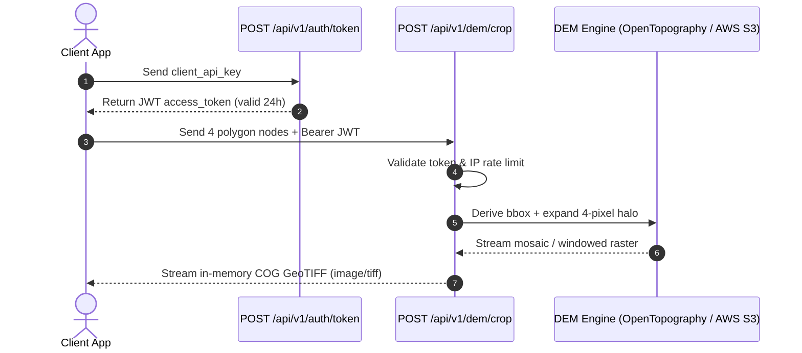

# Sezerium_serv

High-performance Global Digital Elevation Model (DEM) cropping and streaming backend built with **FastAPI**, **Python 3.13**, **NumPy 2.0+**, and **Rasterio**.

`Sezerium_serv` extracts targeted elevation bounding boxes from **OpenTopography Global DEMs** or direct **AWS Open Data Copernicus DEM GLO-30 (30m)** via HTTP range requests, pads the perimeter with a **4-pixel real terrain halo** for client-side reprojection and warping, and streams the result directly as an in-memory **Cloud Optimized GeoTIFF (COG)**.

---

## What It Provides

- **Dual DEM Provider Architecture:**
  - **OpenTopography Global DEM API:** Query datasets worldwide including `COP30` (Copernicus 30m), `COP90` (Copernicus 90m), `SRTMGL1` (SRTM 30m), `AW3D30` (ALOS World 3D 30m), and `NASADEM`.
  - **Direct AWS S3 Streaming:** Direct COG spatial windowing from `s3://copernicus-dem-30m` using GDAL HTTP range requests with zero unnecessary data transfer.
  - **Automatic Fallback:** Seamlessly falls back from OpenTopography to direct AWS S3 Copernicus DEM windowing if OpenTopography limits or network errors are encountered on `COP30`.
- **4-Pixel Real Terrain Halo:**
  - Automatically expands the query bounding box by 4 pixels in all cardinal directions.
  - Guarantees genuine surrounding terrain data is included so client applications can perform smooth reprojections, edge warping, and spline upscaling without edge clipping or seam artifacts.
- **Multi-Tile Seamless Mosaicing:**
  - Automatically stitches multiple $1^\circ \times 1^\circ$ degree tiles into a unified array when an area crosses latitude/longitude degree boundaries.
- **Ocean & Water Body Defaulting:**
  - Automatically detects open ocean and water bodies (where elevation tiles do not exist or OpenTopography returns `204 No Content`) and generates a flat `0.0m` elevation surface.
- **In-Memory Cloud Optimized GeoTIFF (COG):**
  - Generates single-band Float32 GeoTIFFs compressed with Deflate and floating-point predictor (`predictor=3`).
  - Zero disk I/O: All raster manipulation and streaming occurs entirely in RAM.

---

## Security Measures

`Sezerium_serv` is built with enterprise security controls designed for public deployments:

### 1. Client JWT Bearer Authentication
- **Token-Based Access:** All DEM inspection and crop endpoints are protected by HMAC-SHA256 signed JSON Web Tokens (`Authorization: Bearer <token>`).
- **Constant-Time Verification:** The token issuance endpoint (`POST /api/v1/auth/token`) validates client API keys using `secrets.compare_digest` to prevent timing side-channel attacks.
- **Configurable Expiration:** Token lifespan is configurable via `JWT_EXPIRATION_SECONDS` (default: 86,400 seconds / 24 hours).
- **FastAPI Dependency Injection:** Strict `Depends(get_current_client)` enforcement returning `401 Unauthorized` for missing, expired, or tampered tokens.

### 2. IP-Based Rate Limiting
- **Abuse & DoS Protection:** Powered by `slowapi` to regulate traffic per client IP.
- **Proxy-Aware Tracking:** Extracts client IPs via `get_remote_address`, respecting `X-Forwarded-For` headers from reverse proxies (Nginx, Caddy, Cloudflare).
- **Per-Route Limits:**
  - `POST /api/v1/auth/token`: `RATE_LIMIT_AUTH=10/minute` (prevents brute-forcing client keys).
  - `POST /api/v1/dem/crop`: `RATE_LIMIT_CROP=60/minute` (protects CPU & upstream bandwidth; configurable for bulk chunking apps).
  - `POST /api/v1/dem/inspect`: `RATE_LIMIT_DEFAULT=120/minute`.
- **Structured 429 Responses:** Returns HTTP `429 Too Many Requests` with a clear JSON error payload and standard `Retry-After` headers.

### 3. Secret & Git Hygiene Isolation
- **Strict `.gitignore` Rules:** `.env`, `.env.*`, `*.env`, and `*.local` are strictly excluded from git tracking to ensure upstream API keys and JWT signing secrets are never exposed on public repositories.
- **Safe Public Template:** A clean [`.env.example`](./.env.example) is provided with placeholder keys.
- **Health Check Masking:** The public `/health` endpoint exposes service status and configuration flags while strictly withholding sensitive API keys and secrets.

### 4. Input Validation & Strict Typing
- **Pydantic v2 Schema Enforcement:** Request coordinates are strictly validated (exactly 4 polygon nodes, latitude within $[-90, 90]$, longitude within $[-180, 180]$).
- **422 Validation Error:** Malformed coordinate structures or invalid node counts return structured HTTP `422 Unprocessable Entity` responses before any backend processing occurs.

---

## How to Use It

### 1. Installation

#### Clone the repository:
```bash
git clone https://github.com/Shokatian-Sajjad/Sezerium_serv.git
cd Sezerium_serv
```

#### Create and activate a Python 3.13 virtual environment:
- **Windows (PowerShell):**
  ```powershell
  py -3.13 -m venv .venv
  .\.venv\Scripts\Activate.ps1
  ```
- **Linux / macOS:**
  ```bash
  python3.13 -m venv .venv
  source .venv/bin/activate
  ```

#### Install dependencies:
```bash
pip install -r requirements.txt
```

---

### 2. Environment Configuration

Copy the template file to `.env`:
```bash
cp .env.example .env
```

Edit `.env` with your settings:
```ini
# --- DEM Provider Configuration ---
OPENTOPOGRAPHY_API_KEY=your_opentopography_api_key_here
OPENTOPOGRAPHY_BASE_URL=https://portal.opentopography.org/API/globaldem
DEM_PROVIDER=opentopography
DEFAULT_DEM_TYPE=COP30

# --- Client Authentication (JWT) ---
CLIENT_API_KEY=sez_client_master_key_2026
JWT_SECRET_KEY=change_this_to_a_long_random_secret_in_production
JWT_ALGORITHM=HS256
JWT_EXPIRATION_SECONDS=86400

# --- IP Rate Limiting ---
RATE_LIMIT_AUTH=10/minute
RATE_LIMIT_CROP=60/minute
RATE_LIMIT_DEFAULT=120/minute
```

---

### 3. Run Automated Tests

Run the full pytest suite (10 unit & integration tests):
```bash
pytest -v test_server.py
```

---

### 4. Start the Server

```bash
python -m uvicorn main:app --host 0.0.0.0 --port 8000 --reload
```

Interactive Swagger documentation is available at:
👉 **`http://localhost:8000/docs`**

---

## API Usage & Workflow



### Step 1: Obtain a JWT Bearer Token

```bash
curl -X POST http://localhost:8000/api/v1/auth/token \
  -H "Content-Type: application/json" \
  -d '{
    "client_api_key": "sez_client_master_key_2026",
    "client_id": "app_worker_1"
  }'
```

**Response (HTTP 200)**:
```json
{
  "access_token": "eyJhbGciOiJIUzI1NiIsInR5cCI6IkpXVCJ9...",
  "token_type": "bearer",
  "expires_in_seconds": 86400
}
```

---

### Step 2: Request Elevation GeoTIFF (`/api/v1/dem/crop`)

```bash
curl -X POST http://localhost:8000/api/v1/dem/crop \
  -H "Authorization: Bearer <YOUR_ACCESS_TOKEN>" \
  -H "Content-Type: application/json" \
  -d '{
    "nodes": [
      {"lat": 45.830, "lon": 6.860},
      {"lat": 45.833, "lon": 6.860},
      {"lat": 45.833, "lon": 6.864},
      {"lat": 45.830, "lon": 6.864}
    ],
    "provider": "opentopography",
    "dem_type": "COP30"
  }' \
  --output crop.tif
```

**Response**:
- **Status:** `200 OK`
- **Content-Type:** `image/tiff`
- **Headers:**
  - `X-DEM-Provider: opentopography`
  - `X-DEM-Type: COP30`
  - `X-DEM-Width: 59`
  - `X-DEM-Height: 47`
  - `X-DEM-Min-Elevation: 4212.9`
  - `X-DEM-Max-Elevation: 4810.7`

---

### Step 3: Inspect Elevation Metadata (`/api/v1/dem/inspect`)

If you want to preview bounding box dimensions and elevation ranges without transferring the binary raster:

```bash
curl -X POST http://localhost:8000/api/v1/dem/inspect \
  -H "Authorization: Bearer <YOUR_ACCESS_TOKEN>" \
  -H "Content-Type: application/json" \
  -d '{
    "nodes": [
      {"lat": 45.830, "lon": 6.860},
      {"lat": 45.833, "lon": 6.860},
      {"lat": 45.833, "lon": 6.864},
      {"lat": 45.830, "lon": 6.864}
    ],
    "provider": "opentopography",
    "dem_type": "COP30"
  }'
```

**Response (HTTP 200)**:
```json
{
  "requested_envelope": {
    "min_lon": 6.860,
    "min_lat": 45.830,
    "max_lon": 6.864,
    "max_lat": 45.833
  },
  "halo_envelope": {
    "min_lon": 6.858888,
    "min_lat": 45.828888,
    "max_lon": 6.865277,
    "max_lat": 45.834166
  },
  "halo_pixel_margin": 4,
  "raster_width": 24,
  "raster_height": 20,
  "min_elevation_m": 4212.95,
  "max_elevation_m": 4810.72,
  "tiles_queried": ["OpenTopography_COP30"],
  "crs": "EPSG:4326",
  "resolution_deg": 0.0002777777777777778,
  "provider": "opentopography",
  "dem_type": "COP30"
}
```

---

## Client Integration Code Examples

### Python (using `requests`)

```python
import requests

SERVER_URL = "http://localhost:8000"
CLIENT_KEY = "sez_client_master_key_2026"

# 1. Obtain JWT Bearer token
auth_resp = requests.post(
    f"{SERVER_URL}/api/v1/auth/token",
    json={"client_api_key": CLIENT_KEY, "client_id": "python_client"}
)
auth_resp.raise_for_status()
token = auth_resp.json()["access_token"]

# 2. Query elevation GeoTIFF
headers = {"Authorization": f"Bearer {token}"}
payload = {
    "nodes": [
        {"lat": 45.830, "lon": 6.860},
        {"lat": 45.833, "lon": 6.860},
        {"lat": 45.833, "lon": 6.864},
        {"lat": 45.830, "lon": 6.864},
    ],
    "provider": "opentopography",
    "dem_type": "COP30",
}

crop_resp = requests.post(f"{SERVER_URL}/api/v1/dem/crop", json=payload, headers=headers)
crop_resp.raise_for_status()

with open("mont_blanc.tif", "wb") as f:
    f.write(crop_resp.content)

print(f"Downloaded GeoTIFF: {len(crop_resp.content)} bytes")
print(f"Elevation Range: {crop_resp.headers.get('X-DEM-Min-Elevation')}m to {crop_resp.headers.get('X-DEM-Max-Elevation')}m")
```

### JavaScript / Node.js / Browser (using `fetch`)

```javascript
const SERVER_URL = "http://localhost:8000";
const CLIENT_KEY = "sez_client_master_key_2026";

async function fetchElevationGeoTIFF() {
  // 1. Authenticate
  const authRes = await fetch(`${SERVER_URL}/api/v1/auth/token`, {
    method: "POST",
    headers: { "Content-Type": "application/json" },
    body: JSON.stringify({ client_api_key: CLIENT_KEY, client_id: "js_worker" })
  });
  if (!authRes.ok) throw new Error("Auth failed: " + authRes.status);
  const { access_token } = await authRes.json();

  // 2. Fetch GeoTIFF ArrayBuffer
  const cropRes = await fetch(`${SERVER_URL}/api/v1/dem/crop`, {
    method: "POST",
    headers: {
      "Authorization": `Bearer ${access_token}`,
      "Content-Type": "application/json"
    },
    body: JSON.stringify({
      nodes: [
        { lat: 45.830, lon: 6.860 },
        { lat: 45.833, lon: 6.860 },
        { lat: 45.833, lon: 6.864 },
        { lat: 45.830, lon: 6.864 }
      ],
      provider: "opentopography",
      dem_type: "COP30"
    })
  });

  if (!cropRes.ok) throw new Error("Crop failed: " + cropRes.status);
  const arrayBuffer = await cropRes.arrayBuffer();
  console.log(`Received GeoTIFF: ${arrayBuffer.byteLength} bytes`);
  return arrayBuffer;
}
```

---

## Configuration Reference

| Environment Variable | Default | Description |
| :--- | :--- | :--- |
| `OPENTOPOGRAPHY_API_KEY` | `""` | Your OpenTopography portal API key. |
| `OPENTOPOGRAPHY_BASE_URL` | `https://portal.opentopography.org/API/globaldem` | OpenTopography Global DEM REST endpoint. |
| `DEM_PROVIDER` | `opentopography` | Default backend provider (`opentopography` or `aws_s3`). |
| `DEFAULT_DEM_TYPE` | `COP30` | Default dataset (`COP30`, `COP90`, `SRTMGL1`, `AW3D30`, `NASADEM`). |
| `CLIENT_API_KEY` | `sez_client_master_key_2026` | Secret master key clients submit to receive a JWT. |
| `JWT_SECRET_KEY` | `change_this_to_a_long_random_secret_in_production` | Secret used to sign HMAC-SHA256 tokens. |
| `JWT_ALGORITHM` | `HS256` | JWT signing algorithm. |
| `JWT_EXPIRATION_SECONDS` | `86400` | Access token lifespan in seconds (default: 24h). |
| `RATE_LIMIT_AUTH` | `10/minute` | Rate limit for `/api/v1/auth/token` per client IP. |
| `RATE_LIMIT_CROP` | `60/minute` | Rate limit for `/api/v1/dem/crop` per client IP. |
| `RATE_LIMIT_DEFAULT` | `120/minute` | Rate limit for inspect and other endpoints per client IP. |

---

## Further Reading

- [CLIENT_GUIDE.md](./CLIENT_GUIDE.md) — Comprehensive client integration guides for Python, Node.js, WebGL, and React.
- [D.md](./D.md) — Full technical architecture, mathematical grid snapping, and halo derivation formulas.

